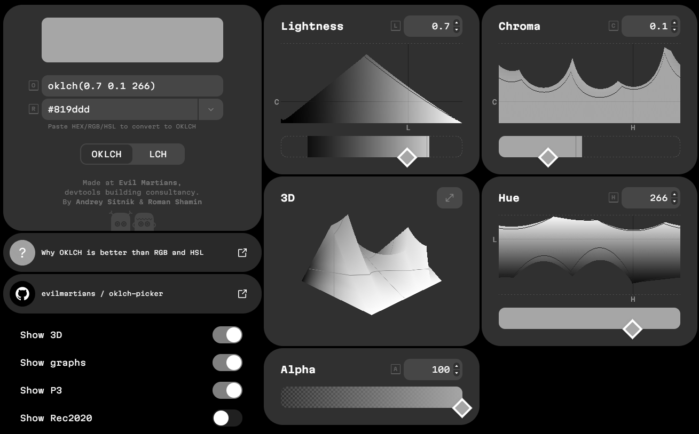

# Screen Filter

A fullscreen filter for Windows.

# Features

- Configurable hotkeys to toggle the filter.
- Refresh rate limiting.
- Start with windows.
- `OkLab` and `Lab` based grayscale filtering.
- Freeze the filter to take screenshots.
- Multi monitor support.

# Why?

In digital painting, we usually use a neutral color filled saturation layer put on top of other layers to check image greyscale.

This approach is not rigorous, as the saturation layers in Photoshop, SAI, and Krita modifies the *saturation* in `HS(C)Y` color model. If the saturation is overridden to 0, the `Y` channel appears, which is interpreted by most artists as *lightness*.

Besides, the color filter accessibility feature that is built-in for Windows also use this approach, which results in inaccurate *lightness*.

This application instead, use `OkLab` and `Lab` color models, and outputs the `L` channel. As these models are perceptual color models, the `L` channel is the real *lightness*, the *lightness* your eye feel.

# Screenshots

> From [OKLCH Color Picker & Converter](https://oklch.com/#0.7,0.1,266,100)

# Credits

Color model converting code is translated from [`bevy`](https://bevy.org/) project under MIT license.
